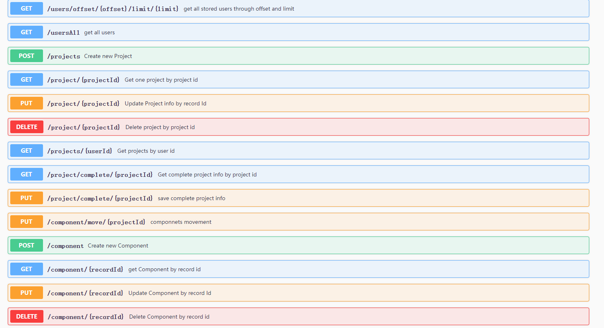

# 低代码后端实例

### 对应的前端代码

[https://github.com/li-car-fei/react-visual-design](https://github.com/li-car-fei/react-visual-design)


### 主要思路

- 运用 oatpp++ 搭建后端服务程序

- Restful API 接口 (Swagger 提供接口示例文档)

- 将低代码的逻辑通过四个表实现
    - user 表：用户信息，一个用户对应多个project
    - project 表：某个低代码编辑图的基础信息；一个project对应多个component
    - component 表：组件表，储存组件类别、属性、序号等；一个component对应0个或多个childComponnet；
    - childComponent 表：子组件表，存储子组件属性、序号等；

- 对 oatpp++ CRUD 的改写：

    - 数据 DTO 有共用字段的采用类的继承方式定义

 ```cpp
    /**
 * 组件记录的 DTO
*/
class ComponentRecordDto : public oatpp::DTO {
  
  DTO_INIT(ComponentRecordDto, DTO)

  DTO_FIELD(Int32, record_id);
  DTO_FIELD(Int32, project_id, "project_id");
  DTO_FIELD(Enum<ComponentType>::AsString, component_type);
  DTO_FIELD(Int32, components_index);
  DTO_FIELD(String, currentDate);
  DTO_FIELD(String, header, "header");
  DTO_FIELD(String, title, "title");
  DTO_FIELD(String, content, "content");
  DTO_FIELD(String, mode, "mode");
  DTO_FIELD(String, src, "src");
  DTO_FIELD(String, link, "link");
  DTO_FIELD(String, label1, "label1");
  DTO_FIELD(String, label2, "label2");
  DTO_FIELD(String, backgroundColor, "backgroundColor");
};

/**
 * 组件记录 包括了子组件数组 数据 的 DTO
*/
class ComponentTransferDto : public ComponentRecordDto {
  DTO_INIT(ComponentTransferDto, ComponentRecordDto)

  DTO_FIELD(Vector<oatpp::Object<ChildComponentTranserDto>>, childs, "childs");
};
```

- Db 部分，每个表的SQL操作分别定义为一个类，随后挂载到一个总的 Db 类中，使用共享的数据库连接池和语句执行器excuator

```cpp
/**
 * 总的 DB 类，管理所有的 数据相关操作类
*/
class Db {
public:
    Db(const std::shared_ptr<oatpp::orm::Executor>& executor)
        : userDb(std::make_shared<UserDb>(executor)),
          projectDb(std::make_shared<ProjectDb>(executor)),
          componentDb(std::make_shared<ComponentDb>(executor)),
          childComponentDb(std::make_shared<ChildComponentDb>(executor))
    {
        std::cout << "Db start creating" << std::endl;
        
        oatpp::orm::SchemaMigration migration(executor);
        migration.addFile(1 /* start from version 1 */, DATABASE_MIGRATIONS "/001_init.sql");
        // TODO - Add more migrations here.
        migration.migrate(); // <-- run migrations. This guy will throw on error.

        auto version = executor->getSchemaVersion();
        OATPP_LOGD("Db", "Migration - OK. Version=%lld.", version);

    };

    std::shared_ptr<UserDb> userDb;
    std::shared_ptr<ProjectDb> projectDb;
    std::shared_ptr<ComponentDb> componentDb;
    std::shared_ptr<ChildComponentDb> childComponentDb;
};
```

- service 方面；

  - 定义一个基础服务类，存储 Db 与所有服务共用的成员

  - 每个表的服务定义一个service，虚继承基础服务类（保证后续派生类只有一个Db连接）；提供每个表自己独立的服务

  - 所有的 service，都继承自基础服务类；即共用一个数据库连接池，共用一套集成好的 SQL 语句接口；

  - 两个表相关的服务，且有层次关系的，如组件和子组件，则采用继承方式实现；使得组件服务可以调用子组件服务；

  - 多个表相关的服务，如整个 project 相关的服务，另外新建一个 service 类，继承所需的服务对应的类实现；

  - 只需直接继承 BaseService 的类是虚继承即可，就可保证所有类中只有一份 Db；

```cpp
/**
 * BaseService
 * 声明 Status 后续子类都用于HTTP状态的码的设定
 * 保存 std::shared_ptr<Db> m_database，用于数据库相关操作
 * 直接继承BaseService的类需要是 virtual 继承，则可保证所有相关Service类中都只有一份Db
*/
class BaseService {
    /* protected ，子类可以访问到，外界不可以访问 */
    protected:
        typedef oatpp::web::protocol::http::Status Status;
        std::shared_ptr<Db> m_database;
    
    public:
        BaseService(std::shared_ptr<Db> database) : m_database(database) {};
};

/* 子组件相关服务 */
class ChildComponentService : virtual public BaseService {

public:
    ChildComponentService(std::shared_ptr<Db> database) : BaseService(database) {};

    /* others... */
};

/* 组件相关服务 */
class ComponentService : public ChildComponentService {

public:
    /**
     * 虚继承中，需要由最上层派生类调用基类的构造函数
     * (普通继承则不用，调用直接继承的基类的构造即可)
    */
    ComponentService(std::shared_ptr<Db> database) : 
        BaseService(database), 
        ChildComponentService(database) {};

    /* others... */
};

```

- controller 方面，与 service 提供的服务对应起来，定义HTTP接口的信息；

  - 每个 controller 都接收指向 Db 的共享指针，以传给对应的 service 成员；

  - controller 继承自 oatpp++ 提供的对象，需要从环境中找到序列化/反序列化器objectMapper用于其初始化

  - 定义一个将所有controller进行统一管理的 MyController，将所有实例（只需一个）挂载到里面，并对外提供统一的controller相关操作接口，如router配置；

```cpp
/**
 * 通过一个 MyController 将所有的 数据库相关的 Controller 包含起来，
 * 统一完成 原本在App.cpp 中的 路由的配置
*/

class MyController {
  public:
  /* 构造函数 ： 一个database对象构建所有 Controller */
    MyController(std::shared_ptr<Db> database) : 
      userController(UserController::createShared(database)),
      projectController(ProjectController::createShared(database)),
      componentController(ComponentController::createShared(database)),
      childComponentController(ChildComponentController::createShared(database)),
      uploadController(UploadController::createShared())
    {};


  /* 静态函数，MyController 只需要一个实例即可 */
    static std::shared_ptr<MyController> createShared(
      std::shared_ptr<Db> database)
    {
      return std::make_shared<MyController>(database);
    }

  /* 通过 MyController 完成 所有 子Controller 的路由配置 */
  void setRouter(
    oatpp::web::server::api::Endpoints& docEndpoints,
    std::shared_ptr<oatpp::web::server::HttpRouter> router)
  {
    docEndpoints.append(router->addController(userController)->getEndpoints());
    docEndpoints.append(router->addController(projectController)->getEndpoints());
    docEndpoints.append(router->addController(componentController)->getEndpoints());
    docEndpoints.append(router->addController(childComponentController)->getEndpoints());
    docEndpoints.append(router->addController(uploadController)->getEndpoints());
  };


  /* 所有的 Controller */
    std::shared_ptr<UserController> userController;
    std::shared_ptr<ProjectController> projectController;
    std::shared_ptr<ComponentController> componentController;
    std::shared_ptr<ChildComponentController> childComponentController;
    std::shared_ptr<UploadController> uploadController;
};
```

- 另外运用oatpp++的文件上传接口提供图片上传，用于AI模型识别；识别后调用projectComplete的服务存储完整低代码视图信息；

```cpp
ENDPOINT_INFO(upload) {
    info->summary = "upload image to parse";
   }
ENDPOINT("POST", "/upload", upload, REQUEST(std::shared_ptr<IncomingRequest>, request)) {

    oatpp::data::stream::FileOutputStream fileOutputStream(UPLOADFILEPATH);
    request->transferBodyToStream(&fileOutputStream); // transfer body chunk by chunk
    return createResponse(Status::CODE_200, "OK");
}
```


### 接口示例

